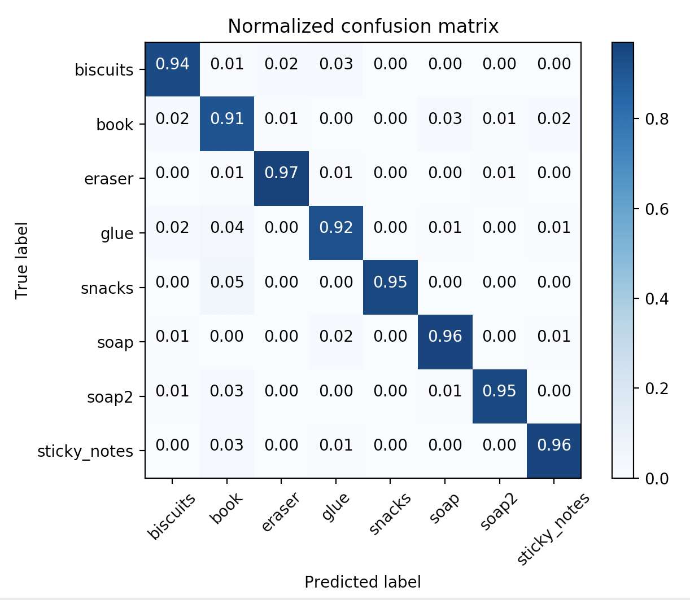
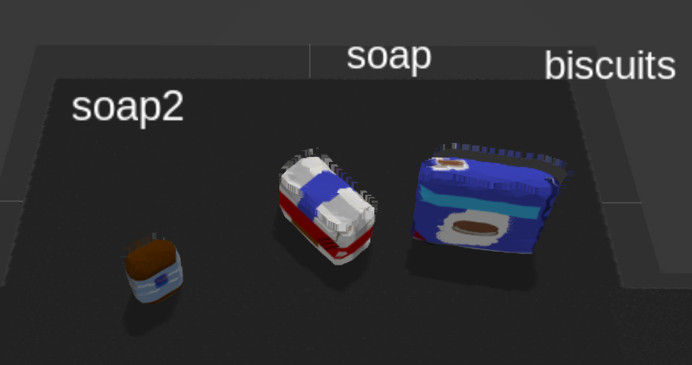
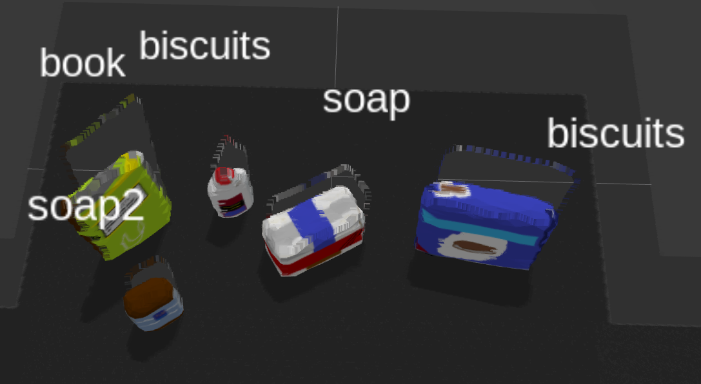
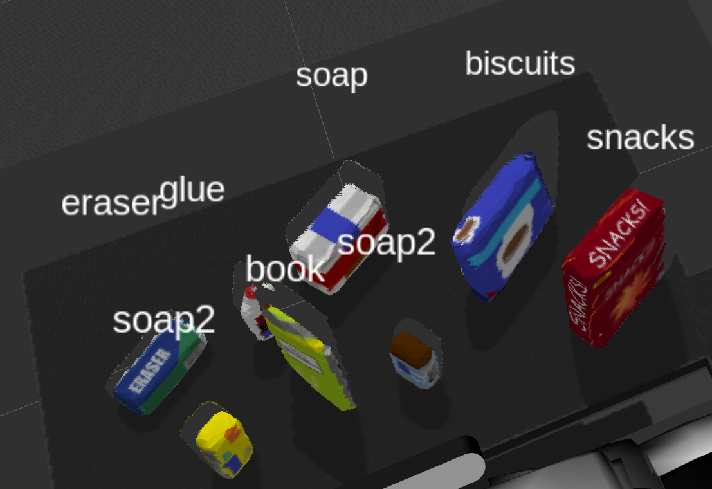

## Project: Perception Pick & Place
### Writeup Template: You can use this file as a template for your writeup if you want to submit it as a markdown file, but feel free to use some other method and submit a pdf if you prefer.

---


# Required Steps for a Passing Submission:
1. Extract features and train an SVM model on new objects (see `pick_list_*.yaml` in `/pr2_robot/config/` for the list of models you'll be trying to identify). 
2. Write a ROS node and subscribe to `/pr2/world/points` topic. This topic contains noisy point cloud data that you must work with.
3. Use filtering and RANSAC plane fitting to isolate the objects of interest from the rest of the scene.
4. Apply Euclidean clustering to create separate clusters for individual items.
5. Perform object recognition on these objects and assign them labels (markers in RViz).
6. Calculate the centroid (average in x, y and z) of the set of points belonging to that each object.
7. Create ROS messages containing the details of each object (name, pick_pose, etc.) and write these messages out to `.yaml` files, one for each of the 3 scenarios (`test1-3.world` in `/pr2_robot/worlds/`).  [See the example `output.yaml` for details on what the output should look like.](https://github.com/udacity/RoboND-Perception-Project/blob/master/pr2_robot/config/output.yaml)  
8. Submit a link to your GitHub repo for the project or the Python code for your perception pipeline and your output `.yaml` files (3 `.yaml` files, one for each test world).  You must have correctly identified 100% of objects from `pick_list_1.yaml` for `test1.world`, 80% of items from `pick_list_2.yaml` for `test2.world` and 75% of items from `pick_list_3.yaml` in `test3.world`.
9. Congratulations!  Your Done!

# Extra Challenges: Complete the Pick & Place
7. To create a collision map, publish a point cloud to the `/pr2/3d_map/points` topic and make sure you change the `point_cloud_topic` to `/pr2/3d_map/points` in `sensors.yaml` in the `/pr2_robot/config/` directory. This topic is read by Moveit!, which uses this point cloud input to generate a collision map, allowing the robot to plan its trajectory.  Keep in mind that later when you go to pick up an object, you must first remove it from this point cloud so it is removed from the collision map!
8. Rotate the robot to generate collision map of table sides. This can be accomplished by publishing joint angle value(in radians) to `/pr2/world_joint_controller/command`
9. Rotate the robot back to its original state.
10. Create a ROS Client for the “pick_place_routine” rosservice.  In the required steps above, you already created the messages you need to use this service. Checkout the [PickPlace.srv](https://github.com/udacity/RoboND-Perception-Project/tree/master/pr2_robot/srv) file to find out what arguments you must pass to this service.
11. If everything was done correctly, when you pass the appropriate messages to the `pick_place_routine` service, the selected arm will perform pick and place operation and display trajectory in the RViz window
12. Place all the objects from your pick list in their respective dropoff box and you have completed the challenge!
13. Looking for a bigger challenge?  Load up the `challenge.world` scenario and see if you can get your perception pipeline working there!

## [Rubric](https://review.udacity.com/#!/rubrics/1067/view) Points
### Here I will consider the rubric points individually and describe how I addressed each point in my implementation.  

---
### Writeup / README

#### 1. Provide a Writeup / README that includes all the rubric points and how you addressed each one.  You can submit your writeup as markdown or pdf.  

You're reading it!

### Exercise 1, 2 and 3 pipeline implemented
#### From Exercise 1 and 2 steps, pipeline for filtering, RANSAC plane fitting and clustering for segmentaion are implemented.
```
# Load Point Cloud file
cloud = pcl.load_XYZRGB('tabletop.pcd')

# Statistical Outlier filter ------------------------------------
outlier_filter = cloud_filtered.make_statistical_outlier_filter()

# Set the number of neighboring points to analyze for any given point
outlier_filter.set_mean_k(50)

# Set threshold scale factor
x = 1.0

# Any point with a mean distance larger than global (mean distance+x*std_dev) will be considered outlier
outlier_filter.set_std_dev_mul_thresh(x)

# Finally call the filter function for magic
cloud_filtered = outlier_filter.filter()

# Voxel Grid filter ----------------------------------------
# Create a VoxelGrid filter object for our input point cloud
vox = cloud.make_voxel_grid_filter()

# Choose a voxel (also known as leaf) size
# Note: this (1) is a poor choice of leaf size   
# Experiment and find the appropriate size!
LEAF_SIZE = 0.01   

# Set the voxel (or leaf) size  
vox.set_leaf_size(LEAF_SIZE, LEAF_SIZE, LEAF_SIZE)

# Call the filter function to obtain the resultant downsampled point cloud
cloud_filtered = vox.filter()
filename = 'voxel_downsampled.pcd'
pcl.save(cloud_filtered, filename)

# PassThrough filter ----------------------------------------
# Create a PassThrough filter object.
passthrough = cloud_filtered.make_passthrough_filter()

# Assign axis and range to the passthrough filter object.
filter_axis = 'z'
passthrough.set_filter_field_name(filter_axis)
axis_min = 0.6
axis_max = 1.1
passthrough.set_filter_limits(axis_min, axis_max)

# Finally use the filter function to obtain the resultant point cloud. 
cloud_filtered = passthrough.filter()
filename = 'pass_through_filtered.pcd'
pcl.save(cloud_filtered, filename)

# RANSAC plane segmentation ----------------------------------------
# Create the segmentation object
seg = cloud_filtered.make_segmenter()

# Set the model you wish to fit 
seg.set_model_type(pcl.SACMODEL_PLANE)
seg.set_method_type(pcl.SAC_RANSAC)

# Max distance for a point to be considered fitting the model
# Experiment with different values for max_distance 
# for segmenting the table
max_distance = 0.01
seg.set_distance_threshold(max_distance)

# Call the segment function to obtain set of inlier indices and model coefficients
inliers, coefficients = seg.segment()

# Extract inliers and outliers
extracted_inliers = cloud_filtered.extract(inliers, negative=False)
extracted_outliers = cloud_filtered.extract(inliers, negative=True)


# Euclidean Clustering --------------------------------
white_cloud = XYZRGB_to_XYZ(cloud_objects) # Apply function to convert XYZRGB to XYZ
tree = white_cloud.make_kdtree()

# Create a cluster extraction object
ec = white_cloud.make_EuclideanClusterExtraction()
# Set tolerances for distance threshold
# as well as minimum and maximum cluster size (in points)
# NOTE: These are poor choices of clustering parameters
# Your task is to experiment and find values that work for segmenting objects.
ec.set_ClusterTolerance(0.02)
ec.set_MinClusterSize(10)
ec.set_MaxClusterSize(1250)
# Search the k-d tree for clusters
ec.set_SearchMethod(tree)
# Extract indices for each of the discovered clusters
cluster_indices = ec.Extract()

# Create Cluster-Mask Point Cloud to visualize each cluster separately
# Assign a color corresponding to each segmented object in scene
cluster_color = get_color_list(len(cluster_indices))

color_cluster_point_list = []

for j, indices in enumerate(cluster_indices):
    for i, indice in enumerate(indices):
        color_cluster_point_list.append([white_cloud[indice][0],
                                        white_cloud[indice][1],
                                        white_cloud[indice][2],
                                            rgb_to_float(cluster_color[j])])

# Create new cloud containing all clusters, each with unique color
cluster_cloud = pcl.PointCloud_PointXYZRGB()
cluster_cloud.from_list(color_cluster_point_list)

# Convert PCL data to ROS messages
ros_cloud_objects = pcl_to_ros(cloud_objects)
ros_cloud_table = pcl_to_ros(cloud_table)
ros_cluster_cloud = pcl_to_ros(cluster_cloud)


# Publish ROS messages
if ros_cloud_objects is not None:
    pcl_objects_pub.publish(ros_cloud_objects)
if ros_cloud_table is not None:
    pcl_table_pub.publish(ros_cloud_table)
if ros_cluster_cloud is not None:
    pcl_cluster_pub.publish(ros_cluster_cloud)
```
#### From Exercise 3 Steps, object recoginition is implemented.
```
    # Classify the clusters! (loop through each detected cluster one at a time)
    detected_objects_labels = []
    detected_objects = []

    for index, pts_list in enumerate(cluster_indices):
        # Grab the points for the cluster from the extracted outliers (cloud_objects)
        pcl_cluster = cloud_objects.extract(pts_list)
        # DONE: convert the cluster from pcl to ROS using helper function
        ros_cluster = pcl_to_ros(pcl_cluster)

        # Extract histogram features
        # DONE: complete this step just as is covered in capture_features.py
        chists = compute_color_histograms(ros_cluster, using_hsv=False)
        normals = get_normals(ros_cluster)
        nhists = compute_normal_histograms(normals)

        # Compute the associated feature vector
        feature = np.concatenate((chists, nhists))

        # Make the prediction, retrieve the label for the result
        # and add it to detected_objects_labels list
        prediction = clf.predict(scaler.transform(feature.reshape(1,-1)))
        label = encoder.inverse_transform(prediction)[0]
        detected_objects_labels.append(label)

        # Publish a label into RViz
        label_pos = list(white_cloud[pts_list[0]])
        label_pos[2] += .4
        object_markers_pub.publish(make_label(label,label_pos, index))

        # Add the detected object to the list of detected objects.
        do = DetectedObject()
        do.label = label
        do.cloud = ros_cluster
        detected_objects.append(do)

        # Add the centroid for pick and place
        centroid = np.mean(pcl_cluster.to_array(), axis=0)[:3]
        detected_objects_dict.setdefault(label, []).append(centroid)

    rospy.loginfo('Detected {} objects: {}'.format(len(detected_objects_labels), detected_objects_labels))
    # Publish the list of detected objects
    # This is the output you'll need to complete the upcoming project!
    detected_objects_pub.publish(detected_objects)
```
For object recognition, features are extracted using `compute_color_histograms` and `compute_normal_histograms` in sensor_stick/features.py.
```
def compute_color_histograms(cloud, using_hsv=False):

    # Compute histograms for the clusters
    point_colors_list = []

    # Step through each point in the point cloud
    for point in pc2.read_points(cloud, skip_nans=True):
        rgb_list = float_to_rgb(point[3])
        if using_hsv:
            point_colors_list.append(rgb_to_hsv(rgb_list) * 255)
        else:
            point_colors_list.append(rgb_list)

    # Populate lists with color values
    channel_1_vals = []
    channel_2_vals = []
    channel_3_vals = []

    for color in point_colors_list:
        channel_1_vals.append(color[0])
        channel_2_vals.append(color[1])
        channel_3_vals.append(color[2])
    
    # DONE: Compute histograms
    r_hist = np.histogram(channel_1_vals, bins=32, range=(0, 256))
    g_hist = np.histogram(channel_2_vals, bins=32, range=(0, 256))
    b_hist = np.histogram(channel_3_vals, bins=32, range=(0, 256))

    # DONE: Concatenate and normalize the histograms
    hist_features = np.concatenate((r_hist[0], g_hist[0], b_hist[0])).astype(np.float64)
    norm_features = hist_features / np.sum(hist_features)

    # Generate random features for demo mode.  
    # Replace normed_features with your feature vector
    #normed_features = np.random.random(96) 
    return norm_features 


def compute_normal_histograms(normal_cloud):
    norm_x_vals = []
    norm_y_vals = []
    norm_z_vals = []

    for norm_component in pc2.read_points(normal_cloud,
                                          field_names = ('normal_x', 'normal_y', 'normal_z'),
                                          skip_nans=True):
        norm_x_vals.append(norm_component[0])
        norm_y_vals.append(norm_component[1])
        norm_z_vals.append(norm_component[2])

    # DONE: Compute histograms of normal values (just like with color)
    x_hist = np.histogram(norm_x_vals, bins=32, range=(0, 256))
    y_hist = np.histogram(norm_y_vals, bins=32, range=(0, 256))
    z_hist = np.histogram(norm_z_vals, bins=32, range=(0, 256))

    # DONE: Concatenate and normalize the histograms
    hist_features = np.concatenate((x_hist[0], y_hist[0], z_hist[0])).astype(np.float64)
    norm_features = hist_features / np.sum(hist_features)

    # Generate random features for demo mode.  
    # Replace normed_features with your feature vector
    #normed_features = np.random.random(96)

    return norm_features
```
I also modified sensor_stick/catpure_features.py to have new training models for the project and to increase the number of the test data.
```
models = [\
       'biscuits',
       'book',
       'snacks',
       'eraser',
       'glue',
       'sticky_notes',
       'soap',
       'soap2']
...
num_of_test_data = 100
for model_name in models:
    spawn_model(model_name)
    
    for i in range(num_of_test_data):
```
And SVM classifier is trained like this.
```
# It launches cloud_transformer and feature_extractor node
roslaunch sensor_stick training.launch

# While launching training.launch
rosrun sensor_stick capture_features.py

# read training_set.sav and write model.sav
rosrun sensor_stick train_svm.py
```
The result was like this.


### Pick and Place Setup

#### 1. For all three tabletop setups (`test*.world`), perform object recognition, then read in respective pick list (`pick_list_*.yaml`). Next construct the messages that would comprise a valid `PickPlace` request output them to `.yaml` format.
Object recognition is performed according to test_scene_num and the PickPlace request output is saved in output_$(arg test_scene_num).yaml.
```
roslaunch pr2_robot pick_place_project.launch test_scene_num:=1
  
rosrun pr2_robot project_template.py
```
The results are 100%, 80% and 100% in test_scene_num 1,2,3 respectively.




I think the accuracy would be increased with the larger number of test data and tuning parameters of SVM.
